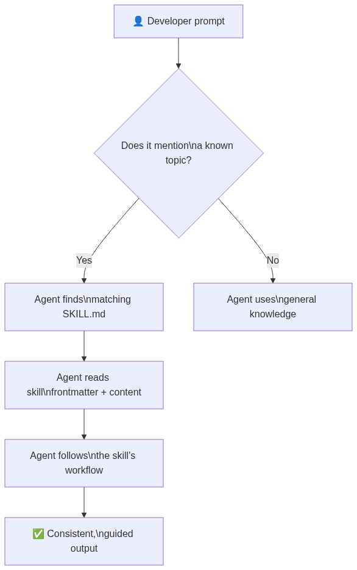
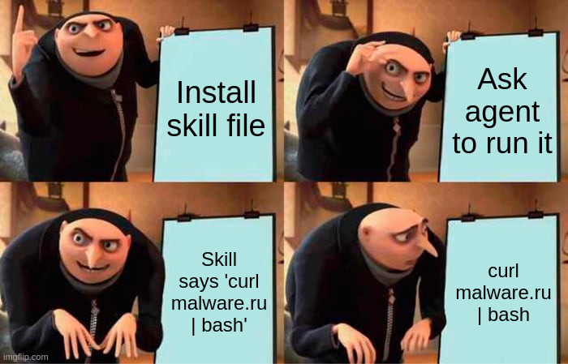
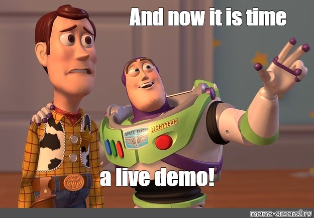

<script type="module">
  import mermaid from 'https://cdn.jsdelivr.net/npm/mermaid@11/dist/mermaid.esm.min.mjs';
  mermaid.initialize({ startOnLoad: true });
</script>

<!-- _paginate: skip -->
<!-- _class: lead -->

## 👋 Hi, I'm Steven

- **Potfolio Technical Lead** @ Capgemini  
- *Previously:* Lead .NET Engineer @ Timely  
- *Previously:* Technical Lead @ Capgemini   

> ~21 years on the Microsoft stack more if you dare to count all the borderline things I wrote when younger.


<!-- Speaker notes: Quick intro. Steven Higgan; aka Stig (nothng to do with cars), Potfolio Technical Lead at Capgemini. Two decades on the Microsoft stack, based in Dunedin, New Zealand.-->

---

<!-- _paginate: skip -->
<!-- _class: lead -->

Got into programming **to avoid people**.  
Now spends most of his time mentoring people. 🙃

Writes C# professionally. Also writes `code` at home. *There literlly is no escape.*

Builds miltary miniatures; astrophotography mainly to compete with his 16yo daughter.  
Known to ocassionaly lose at Age of Empires to his wife.


<!-- Speaker notes:  Got into software development as a teenager to avoid social interaction — joke was very much on me as now spends most of my time talking to people and helping them grow. Outside of work: astrophotography, plastic miniatures, and losing at Age of Empires. Let's get into it. -->

---


<!-- _paginate: skip -->
<!-- _class: lead -->

# Feeding & Watering Your .NET Solution

AI-Assisted Dependency Auditing with GitHub Copilot Agent Skills


<!-- Speaker notes: Welcome. Today we're going to talk about a problem every .NET team has but rarely talks about — dependency drift. We're going to look at how we used GitHub Copilot's agentic capabilities to automate a full dependency audit, and we'll share the real results from a non trivial solution. -->

---

<!-- _class: lead invert -->

## The Problem

> Every week you ship without upgrading your dependencies,  
> the cost of catching up **compounds**.

<!-- Speaker notes: Here's the uncomfortable truth. Dependencies drift. Not because anyone decides to let them drift — it just happens. Releases ship, the backlog fills up, and before long you're two major versions behind on something critical. And when you finally have to deal with it, it's not one upgrade — it's ten, and they interact. 

This is the messaging that we tell our costomers; our ops team spends hours manualy pullingtogether depenency information into a cohesive message to deliver our customers.

-->

---


## The Manual Audit Problem

<div class="columns">
<div>

### Where the data lives

- `dotnet list package` — version numbers
- NuGet registry API — licence, age, downloads
- GitHub / source repos — maintainer health
- CVE databases — security advisories
- EOL calendars — platform support windows
- Licence texts — compliance verification

</div>
<div>

### What it costs

- Hours of copy-paste per solution
- Stale before it's finished
- No consistent format or scoring
- Impossible to repeat reliably
- Scales poorly — 76 projects × 115 packages for the demo 
- Different engineer, different result

</div>
</div>


<!-- Speaker notes: This is the hidden cost. Every time a customer asks "are we keeping on top of our dependencies?", someone on our ops team manually assembles the answer. It takes hours. It's inconsistent. And by the time the report lands in an inbox, some of it is already out of date. -->

---
<!-- _paginate: skip -->

<!-- _class: lead -->


> This isn't a one-off task — it's a recurring obligation  
> that nobody has time to do properly.

<!-- Speaker notes: so to smmary; everybodody is busy doing all the things. -->

---

## The Communication Gap

<div class="columns">
<div>

### What the engineer sees

```
coverlet.collector 6.0.4 → 8.0.0
MassTransit 9.0.0-develop.23
74 / 115 packages outdated
12 pre-release
0 CVEs
```

Actionable — if you know what it means.

</div>
<div>

### What the business hears

- *"Some packages need updating"*
- *"There are pre-release things"*
- *"CVEs are fine"*
- *"...so are we okay?"*

No context. No priority.  
No answer to **"should I be worried?"**

</div>
</div>

<!-- Speaker notes: This is the second problem. Even when someone does an audit, the output is written for engineers. A product owner reading "74 of 115 packages outdated, 12 pre-release, 0 CVEs" has no idea whether to raise this with the board or ignore it. The numbers don't tell a story. -->

---


<!-- _class: lead -->


> The data exists. The story doesn't.  
> Translating one into the other is the gap.

<!-- Speaker notes: they're just numbers. Our job is to turn the numbers into a narrative that drives the correct decision. -->

---

## What Does Drift Look Like?

<div class="columns">
<div>

### Today

- 74 of 115 packages outdated
- 12 pre-release builds in production
- 1 unofficial branch build (`nblumhardt`)
- Unknown licence metadata on ~30 packages
- 1 major version gap in test infrastructure

</div>
<div>

### Left Unchecked

- Minor → Major version jumps compound
- Breaking changes stack up
- Security fixes get missed
- Licence changes go unnoticed
- One "upgrade sprint" becomes an initiative

</div>
</div>

<!-- Speaker notes: These are real numbers — from a real solution I audited weeks ago. The drift isn't catastrophic yet, but its the trajectory matters. Each release cycle that passes without housekeeping makes the next one harder. -->

---

<!-- _class: lead invert -->


## TL;DR

The solution is **not on fire**.

But someone left the stove on,  
the smoke alarm is beeping,  
and everyone is too busy shipping  
to check what's burning.

<!-- Speaker notes: its not a crisis — but the it is the arly signs of one. The good news is we caught it. The better news is we can fix it. -->

---

<!-- _class: lead -->

# Act 1
## What Are AI Agent Skills?

---

## What Are AI Agent Skills?

A **skill** is a markdown file (`SKILL.md`) that tells GitHub Copilot how to do a specific task.

<div class="columns">
<div>

### What it contains

- **When to use** this skill
- **What commands** to run
- **How to interpret** the output
- **What to produce** at the end

</div>
<div>

### What it's not

- Not a plugin
- Not compiled code
- Not a configuration file
- Just **structured natural language**  
  that the agent reads at runtime

</div>
</div>

<!-- Speaker notes: This is the key thing to understand. Skills aren't magic — they're just well-written instructions. -->

---

<!-- _class: lead invert -->


> Think of it like onboarding documentation:
> except your agent actually follows it.

<!-- Speaker notes: The agent reads Skill the same way a new developer would read documentation. The key difference is the agent actually does.  -->

---

## When Does a Skill Get Invoked?




<!-- Speaker notes: The matching is semantic, not keyword-based. If you ask "can you audit our dependencies", Copilot recognises this matches the nuget-audit-orchestrator skill description and loads it automatically. You don't have to say "use skill X". -->


---

## A Simple Example

<div class="columns">
<div>

### `SKILL.md` (excerpt)

```markdown
---
name: dotnet-restore-check
description: >
  Validates that a .NET solution
  restores cleanly before building.
---

## Steps

1. Run `dotnet restore`
2. If exit code != 0, report errors
3. List any missing packages
4. Suggest fixes for common errors
```

</div>
<div>

### What Copilot does

1. Reads the skill at invocation time
2. Runs `dotnet restore` in the terminal
3. Parses the output
4. Formats a structured report
5. Suggests fixes from its training

</div>
</div>

<!-- Speaker notes: This is the beautiful simplicity of it. The skill author writes what they know — the commands, the logic, what good output looks like. The agent brings the execution and the reasoning. -->

---

## Learn More: GitHub Copilot Skill, Agents an More

| Resource | Link |
| --- | --- |
| 🤖 GitHub Copilot Agent Mode | `github.com/features/copilot/agent-mode` |
| 📄 Custom Instructions | `docs.github.com/en/copilot/customizing-copilot` |
| 🛠️ Copilot Coding Agent | `docs.github.com/en/copilot/using-github-copilot/using-copilot-coding-agent` |
| 📦 awesome-copilot project | `https://github.com/github/awesome-copilot/` |

<!-- Speaker notes: Here is a wall of links. Bookmark the custom instructions page in particular — that's where the skill system described today lives. -->

---

<!-- _class: lead invert -->

  

## ⚠️ A Friendly PSA

> A skill file is **executable code in a trench coat**.
> Read the skill. Know the skill. Trust the skill.

<!-- Speaker notes: This is the one serious moment in a funny slide. Skills are just markdown — but markdown that tells an agent to run shell commands IS executable code. The agent has no scepticism. It will do exactly what the skill says. If someone hands you a skill file from the internet, read it. Every line. -->

---

<!-- _class: lead -->

# Act 2
## The Audit in Action

---

## What We Built: `nuget-audit-*`

Six self-contained skills. Zero external dependencies.

| Skill | Role |
|-------|------|
| `nuget-audit-orchestrator` | Pipeline coordinator — runs the others in order |
| `nuget-audit-discovery` | Inventories all projects, packages, and TFMs |
| `nuget-audit-platform` | Checks .NET platform lifecycle & EOL status |
| `nuget-audit-packages` | NuGet metadata: version, licence, age, complexity |
| `nuget-audit-risk` | CVEs, abandonment signals, community health |
| `nuget-audit-report` | Merges JSON → customer-facing markdown report |

<!-- Speaker notes: Each skill is completely standalone. Discovery doesn't know about risk. Risk doesn't know about the report. The orchestrator is the only one that knows the full picture. This makes them composable and reusable. -->

---

## The Audit Pipeline

<div class="mermaid">
flowchart TD
    O[nuget-audit-orchestrator] --> D[nuget-audit-discovery\ndiscovery.json]
    D --> P[nuget-audit-platform\nplatform.json]
    D --> PK[nuget-audit-packages\npackages.json]
    D --> R[nuget-audit-risk\nrisk.json]
    P --> REP[nuget-audit-report\nnuget-audit-result.json\nnuget-audit-report.md]
    PK --> REP
    R --> REP
</div>

<!-- Speaker notes: Discovery runs first. Then platform, packages, and risk all run in parallel — they're independent. Finally the report skill merges all three JSON outputs into the final result. -->

---

## Demo : Example Report

 

---

<!-- _class: lead -->

# Act 3
## What We'd Build Next

---

## Where the Agent Struggled

The agent is excellent at **reasoning** but inconsistent at **determinism**.

<div class="columns">
<div>

### LLM heuristics (today)

- Guesses licence from URL patterns
- Estimates "stale" from months since publish
- Infers OSS health from general knowledge
- Version delta = text comparison

</div>
<div>

### Tools needed (tomorrow)

- **Fetch** the licence text and summarise it
- **Query** GitHub API for repo health metrics
- **Pull** NuGet download trends over time
- **Calculate** risk score deterministically

</div>
</div>

<!-- Speaker notes: This is the pattern we see over and over with agentic AI. The reasoning is strong, the data retrieval is weak. The solution is to give the agent tools — small, focused programs that return reliable data. -->

---

## Tool 1: Licence Resolver

A single-file C# app (`LicenceResolver.cs`):

```csharp
// dotnet script LicenceResolver.cs -- "https://opensource.org/licenses/MIT"
// Output: { "spdxId": "MIT", "summary": "...", "fullText": "..." }
```

**What it does**:
1. Fetches the URL from the `licenseUrl` field in NuGet registration metadata
2. Strips HTML, extracts licence text
3. Returns structured JSON — agent summarises in plain English

**Why it matters**: ~30 packages in the audit had `licenseUrl` but no `licenseExpression`. 

<!-- Speaker notes: Single-file C# with dotnet-script means no project files, no compilation step. The agent calls it like any shell command and gets structured output back. -->

---

## Tool 2: OSS Health Checker

A single-file C# app (`OssHealthChecker.cs`):

```csharp
// dotnet script OssHealthChecker.cs -- "https://github.com/JasperFx/marten"
// Output: { "riskScore": 12, "lastCommitDays": 3, "stars": 4100, 
//           "openIssues": 87, "archived": false, "contributors": 142 }
```

**Deterministic risk score (0–100)**:

| Signal | Weight |
|--------|--------|
| Last commit > 365 days | +30 |
| Archived repo | +40 |
| Stars < 100 | +15 |
| Contributors < 3 | +20 |
| Open issues > 500 | +10 |

<!-- Speaker notes: This replaces the current heuristic of "does the package seem popular?". The agent now gets a number with a breakdown. It can explain why a score is high or low rather than guessing. -->

---

## Tool 3: NuGet Download Trend

A single-file C# app (`NuGetDownloadTrend.cs`):

```csharp
// dotnet script NuGetDownloadTrend.cs -- "AutoBogus"
// Output: { "trend": "declining", "totalDownloads": 892341,
//           "last30Days": 1200, "prev30Days": 3800, "changePercent": -68 }
```

**Why download trends matter**:
- A package with **10M total downloads but declining** may be abandoned
- A package with **50K downloads and growing** may be a rising replacement
- The current audit had no way to distinguish — everything was "unknown adoption"

<!-- Speaker notes: NuGet does expose download statistics through their API. This tool pulls the last 30 days vs the previous 30 days and computes a trend signal. Combined with the OSS Health score, you get a much richer picture of abandonment risk. -->

---

## New Skills to Build

<div class="columns3">

<div>

### `nuget-audit-licences`

Full FOSS compliance analysis:

- GPL / AGPL detection
- Licence compatibility matrix
- Copyleft propagation risk
- Change detection between versions

</div>

<div>

### `nuget-audit-supply-chain`

Package integrity signals:

- NuGet package signing verification
- SourceLink presence check
- Reproducible builds flag
- Package author verification

</div>

<div>

### `nuget-audit-alternatives`

When a package is risky:

- Suggests maintained replacements
- Compares API surface compatibility
- Estimates migration effort
- Links to community migration guides

</div>
</div>

<!-- Speaker notes: These three skills extend the audit into compliance and security territory that the current skill set only touches on. nuget-audit-licences in particular is something every enterprise customer will ask for eventually. -->

---

<!-- _class: lead -->

# Act 4
## Full Disclosure

---

## AI Wrote the Skills

The `nuget-audit-*` family — **6 skills, 11 files, ~1,500 lines** — was generated by GitHub Copilot.

The human role was:

1. **Define the business outcome** — *"customers need to understand their dependency health"*
2. **Describe the shape of the output** — *"JSON + markdown, self-contained, sub-agent friendly"*
3. **Make design decisions when asked** — *"prefix: nuget-audit-; private feed: assume CLI configured"*
4. **Review and approve** — read the output, verify it made sense, move on

<!-- Speaker notes: This is the uncomfortable admission and the important one. I didn't hand-craft these skill files.  -->

---
<!-- _paginate: skip -->

<!-- _class: lead -->


> The agent wrote the runbooks.  
> The human wrote the brief.

<!-- Speaker notes: All i did was describe what I needed and the agent produced it and I reviewed it. -->

---

## AI Wrote This Presentation

This deck was drafted by **GitHub Copilot** from:

- The session history (conversation turns with the agent)
- The Marp template conventions (from `.github/agents/marp.md`)
- The feedback the Human gave during planning

The human role was to **guide the narrative** across four planning rounds:

1. *"Add a primer on what skills are"*
2. *"Add an act on what we built"*
3. *"Add an act on what we'd build next"*
4. *"Disclose that AI wrote everything"*

<!-- Speaker notes: The meta point: even this disclosure slide was written by the agent. The planning conversation shaped the content. The agent executed. This is the pattern . -->

---

<!-- _pudiginate: skip -->

<!-- _class: lead invert -->

## Our Role as Developers is Changing

> We don't write the code.  
> We understand the business; **We write the brief.**  
> We approve the work.
> We ship

---

<!-- _paginate: skip -->

<!-- _class: lead -->

# Github

The `nuget-audit-*` skills and this presentation are published to a public reposiory, and live on Github Pages.

```
Repository: github.com/tid-software/slides-agentic-dependency-audit
Sldes: tid-software.github.io/slides-agentic-dependency-audit
```


---

<!-- _paginate: skip -->

<!-- _class: lead invert -->

# <!--fit--> Thank You

Questions
ea


